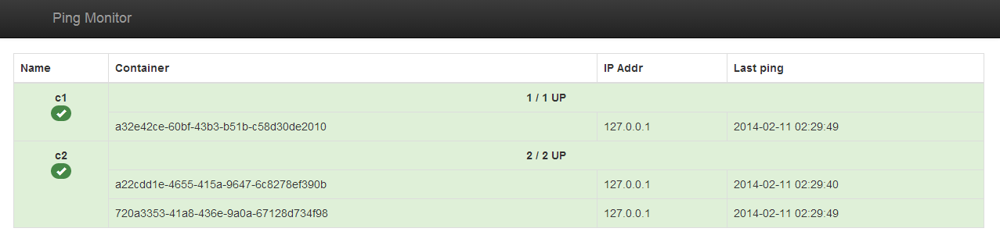

# Hubiquitus-ping-monitor

This module provides a binary that launches a webapp to monitor alives hubiquitus container in your system.
This webapp provides the following paths :

  - `/ping/:id/:name` : ping service to collect pings emitted by a [**hubiquitus-ping**](https://github.com/hubiquitus-addons/hubiquitus-ping) module
  - `/` : service to display the system status
  - `/statusfull` : service that sends a 200 HTTP code if **all** expected containers are up, 500 else
  - `/status` : service that sends a 200 HTTP code if **at least one** container of each type is up, 500 else

Install the module with :

    $ npm install -g hubiquitus-ping-monitor

Note : the `-g` option needs root privileges.

The provided executable is `h-ping-monitor`.
The available options are :

  - -h, --help          output usage information
  - -V, --version       output the version number
  - -p, --port [n]      HTTP port
  - -d, --debug         debug
  - -f, --file [path]   configuration file


Before launching `h-ping-monitor`, first create a configuration file specifying which and how much containers you want to follow. For example :

monitoringConf.json
```
{
  "c1": 1,
  "c2": 2
}
```
This configuration file specifies that the monitoring app expects three containers to ping : one **c1** and two **c2** containers.
Launch hubiquitus-ping-monitor with :

    $ h-ping-monitor -f path/to/Conf.json

Note that you may have to wait up to 30 seconds so that pings are received by your monitor.
On the monitoring webapp, the main page will then display :



We can see that the *c1* container and both *c2* containers are running.
